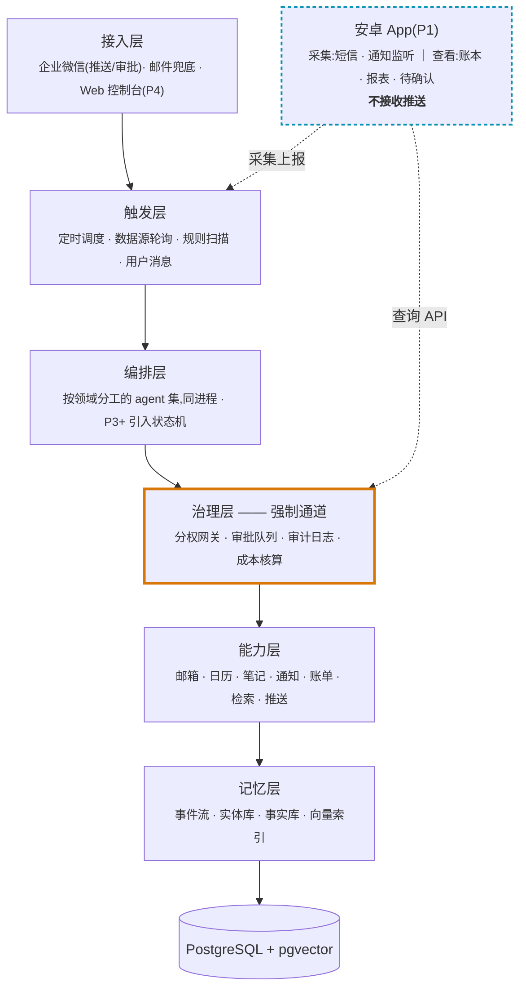

# LifeIn

**自托管的个人生活 agent**

它读你的邮箱、日历、账单和笔记,把散落各处的生活信息整理成长期记忆, 
通过企业微信推送给你 —— 但凡要动外部世界,先问过你。

[产品定义](docs/01-product-spec.md) ·
[架构设计](docs/02-architecture.md) ·
[开发计划](docs/03-roadmap.md) ·
[技术决策](docs/04-tech-decisions.md) ·
[风险登记](docs/05-risks.md)

---

## 它是什么

一个跑在你自己服务器上的程序。定时读取你的邮箱、日历、账单和笔记,
归一成结构化的生活事件流,提炼成能长期积累的记忆,
再通过企业微信给你推送摘要和提醒。你也可以直接在企微里问它、让它干活。

**它不是**:通用 agent 框架、给陌生人用的商业产品、又一个聊天机器人。

> [!NOTE]
> `LifeIn` 是工作代号,可随时替换。

---

## 架构

**治理层是强制通道。** 能力层的任何工具都不允许被编排层直接调用,
必须经过分权网关。这一条在代码结构上强制,不靠约定。

### 工具三级分权

| 等级 | 含义 | 示例 | 网关行为 |
| :---: | --- | --- | --- |
| **L1** | 只读 | 查邮件、查日历、检索记忆 | 放行 + 审计 |
| **L2** | 写自己的地盘 | 建待办、改日历、归类账单 | 放行 + 审计 + 记录回滚信息 |
| **L3** | 写外部世界 | 代发消息、提交表单、预约 | **拦截 → 审批队列** |

未声明等级的工具**默认按 L3 处理**,防止新增工具漏标造成越权。

---

## 四条核心设计约束

<table>
<tr>
<td width="50%" valign="top">

### 数据整合 > agent 编排

把邮件、日历、账单、笔记归一成统一的生活事件流是脏活,没有技术含量,
但没有它上层全是空的。

</td>
<td width="50%" valign="top">

### 长期记忆是唯一护城河

生活助手的价值几乎全部来自"它记得你"。
所有记忆强制携带来源 —— 无法追溯的记忆终将变成噪音。

</td>
</tr>
<tr>
<td width="50%" valign="top">

### 能动手就必须能刹车

一切写外部世界的操作走审批队列,可回滚,有审计,幂等,超时失效。

</td>
<td width="50%" valign="top">

### 每一期都要能真的用起来

不接受"先搭三个月基础设施"。每期都有验收标准和退出条件。

</td>
</tr>
</table>

---

## 路线图

| | 阶段 | 主题 | 验收标准 | 估计 |
| :---: | :---: | --- | --- | :---: |
| 🔨 | **P0** | 邮箱 + 日历 → 每日摘要 | 你自己每天真的会打开它 | 2–3 周 |
| ⬜ | **P1** | 记忆层 + 安卓 App + 主动触发 | 它开始"记得你",且提醒不烦人 | 6–8 周 |
| ⬜ | **P2** | 财务与账单 + App 账本 | 你不再逐笔记账 | 6–8 周 |
| ⬜ | **P3** | 审批执行 | 你敢让它代发一条真实消息 | 4–5 周 |
| ⬜ | **P4** | 多用户托管 + Web 控制台 | **朋友才在这一步进来** | 5–7 周 |

> [!IMPORTANT]
> **朋友接入推迟到 P4 是硬约束,不是排期偷懒。**
> 一旦有第二个用户,你就成了别人邮箱授权码和支付数据的保管人 ——
> 这是法律责任而非仅技术责任。P0–P3 期间你需要随时重构、删库、改 schema 的自由。
>
> 但**多用户的技术预留必须从 P0 第一行代码就做**:全表带 `user_id`、
> 凭据字段级加密、数据访问不假设单用户。推迟的是**开放**,不是**准备**。

详见 [开发计划](docs/03-roadmap.md)。

---

## 技术栈 (P0)

| 用途 | 选型 |
| --- | --- |
| 服务端 | Python 3.11+ · FastAPI([ADR-016](docs/04-tech-decisions.md#adr-016--服务端用-python--fastapi)) |
| 客户端 | 安卓原生 Kotlin,不做 iOS([ADR-015](docs/04-tech-decisions.md#adr-015--app-用原生-kotlin只做安卓)) |
| 调度 | APScheduler(进程内,不引入消息队列) |
| 存储 | PostgreSQL + pgvector(单库,不引入独立向量库) |
| 模型 | 外部 LLM API 直调(OpenAI 兼容接口,换 base_url + model 即切换厂商),**P0 不套 agent 框架** |
| 入口 | 企业微信(推送 + 审批卡片)· 安卓 App(采集 + 查看,**不接收推送**) |
| 数据源 | 邮箱 IMAP + 授权码(QQ / 163)· 企业微信日程 API · 交易通知 webhook(P2) |

<b>为什么没有 LangGraph / MCP / hook / 多 agent?</b>

 

选型标准只有一条:**适合项目才用,不为了用而用。**
以下技术都经过逐条评估后否决,每条都在 [技术决策](docs/04-tech-decisions.md)
里写明了**将来重新评估的触发条件**。

| 技术 | 当前不用的理由 | 何时重新考虑 |
| --- | --- | --- |
| **LangGraph** | P0–P2 是"拉数据 → 调 LLM → 推送"的脚本级流程,上框架是纯负担 | **P3** —— 审批要求流程暂停数小时后从断点恢复,那时 checkpoint / interrupt 才真正划算 |
| **MCP** | 只有一个后端在调工具,包一层 MCP 是白加抽象。工具治理是治理层的事,与 MCP 无关 | 当你想**在其他 MCP client 里也直接查自己的邮件和账单** —— 一套工具两个消费方,MCP 立刻划算 |
| **Hook 机制** | Hook 是给第三方扩展用的抽象,本项目没有第三方。拦截 L3 就是网关里的一个分支判断 | 基本不会 —— 与"不做通用框架"的非目标冲突 |
| **多 agent 竞争择优** | 该范式需要客观验收标准且值得 N 倍 token,生活任务两条都不满足 | 基本不会。注意 agent **按领域分工已经在做**(摘要 / 问答 / 记忆 / 日程 / 记账 / 执行,同进程运行),那是模块划分,与竞争择优是两回事 |
| **独立向量数据库** | 当前数据量下纯属增加运维复杂度,跨库事务一致性也难保证 | 向量数据超百万级且检索延迟成为瓶颈 |

---

## 文档导航

| 文档 | 回答什么问题 |
| --- | --- |
| [01 产品定义](docs/01-product-spec.md) | 给谁用、解决什么、边界在哪、**明确不做什么** |
| [02 架构设计](docs/02-architecture.md) | 系统怎么分层、数据怎么存、记忆和审批怎么工作 |
| [03 开发计划](docs/03-roadmap.md) | P0–P4 分期,每期的验收标准和**退出条件** |
| [04 技术决策](docs/04-tech-decisions.md) | 每个选型的理由,**以及被否决的方案和否决理由** |
| [05 风险登记](docs/05-risks.md) | 隐私、合规、提示注入、成本、信任、平台政策 |

新加入的人建议按 **01 → 03 → 04** 的顺序读。

> [!WARNING]
> 04 里记录了大量"为什么不做 X"。三个月后最容易犯的错,
> 就是把这些当成遗漏而随手加回来。**动手改架构前请先读对应条目。**

---

## 开发约定

- **一个可独立描述的改动 = 一次提交 = 一次推送**,不攒批
- 提交信息说清**为什么**这么改,不只是改了什么 —— 三个月后你只会记得 why
- 引入新依赖或新技术前,先在 [04](docs/04-tech-decisions.md) 补一条 ADR,
  写明被否决的替代方案和将来重新评估的触发条件
- 每期结束写复盘,把新学到的和被推翻的结论回写进 04

---

本项目会接触真实的个人邮件、日历与支付数据。 
凭据与数据一律不入仓库,详见 <a href="docs/05-risks.md">风险登记</a>。

